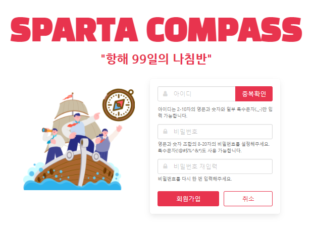
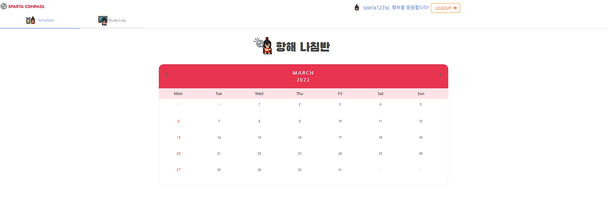
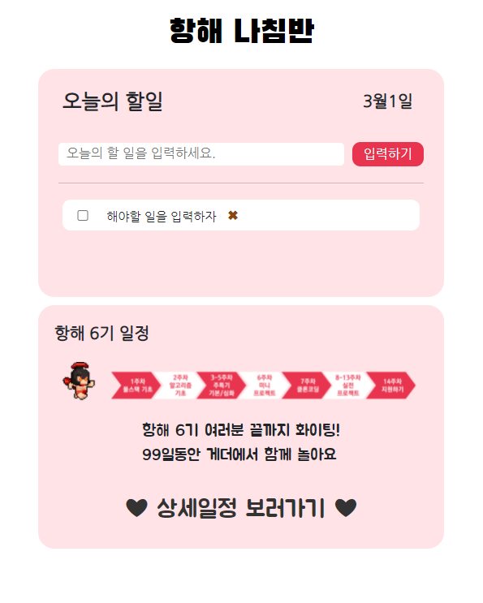
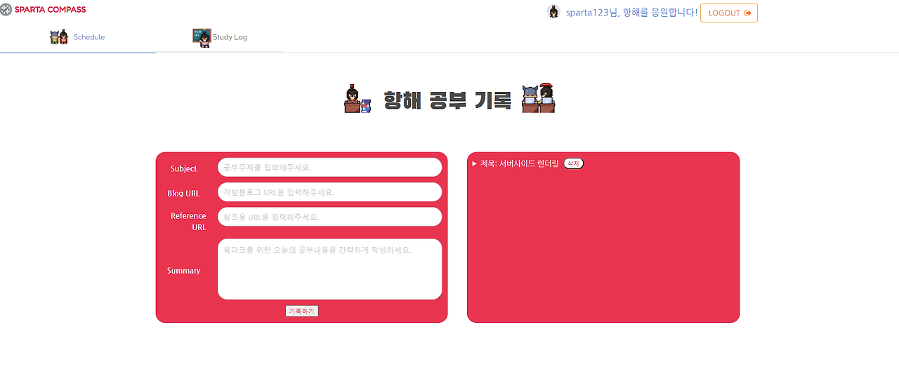

# 항해 99 1주차 - 웹 개발 미니프로젝트

 


## 프로젝트 개요

- **프로젝트 기간**: 2022.03.07~2022.03.10 (총 4일간)
- **프로젝트명**: 스파르타 항해 나침반 (H-Compass)
- **사용 기술**: Python, Html, Css, MongoDB

## 기획배경

99일의 항해기간동안 개인/팀 스케줄 및 개발 공부 내용을 기록하면서 올바른 방향으로 나아가고 있는지를 체킹할 수 있도록 하는 웹사이트를 만들어보고 싶었다.

- **필수 포함 사항**: Jinja2 템플릿 엔진을 이용한 서버사이드 렌더링, JWT 인증 방식으로 로그인 구현하기

## 구현한 페이지 및 기능

### 1. 로그인 / 회원가입 페이지

- **로그인/로그아웃 기능**
  - JWT 인증방식을 이용한 로그인
  - 빈칸 없이 모두 입력했는지
  - 로그인 완료시 메인 페이지로 이동
  - 로그아웃 버튼 클릭시 로그아웃
- **회원가입 기능**
  - 아이디 및 비밀번호 입력 조건 판단하기
  - 아이디 중복확인
  - 비밀번호 확인
  - 회원가입 완료시 로그인 페이지로 이동

### 2. 달력 페이지(메인 페이지)

- **달력 기능**
  - 날짜 클릭시 해당 날짜의 todo-list 페이지로 이동
  - 월간 이동

### 3. todo-list 페이지(내가 맡은 부분)

- **todo-list 기능**
  - 할일 입력칸 입력시 투두리스트 추가
  - 할일 입력칸이 빈칸일 경우 입력하기 버튼 비활성화
  - 체크박스 선택시 빨간 취소선으로 완료표시
  - 체크박스 해제시 원래 상태로 되돌리기
  - X 버튼 클릭시 투두리스트 삭제하기
  - 항해 나침반 클릭시 메인페이지로 이동
  - 상세일정 보러가기 클릭시 노션 일정페이지로 연결

### 4. 공부기록 페이지

- **공부기록 페이지 기능**
  - 입력칸 입력 후 기록하기 버튼 클릭시 오른쪽에 리스트 추가
  - 리스트 클릭시 내용 펼치기
  - 완료 버튼 클릭시 취소선 추가
  - 취소 버튼 클릭시 원래상태로 되돌리기
  - 삭제 버튼 클릭시 리스트 삭제

### 5. 깃허브 레파지토리

- [GitHub - Hanghae99-6-9/Hanghae99_MiniProject](https://github.com/Hanghae99-6-9/Hanghae99_MiniProject)

## What I Learned

- JWT 인증 방식과 Jinja2 템플릿을 이용한 서버사이드 렌더링에 대해서 처음 알게 되었고 이를 미니프로젝트에 적용하면서 로그인 시 회원정보를 어떻게 가져올 수 있는지, 페이지 이동이 어떤식으로 이루어지는지 등을 경험해볼 수 있게 되었다.
- 또한 팀원들과의 소통이 중요하다는 것을 다시한번 깨달았으며 혼자 힘으로 해결해나가는 것보다 팀원들과 함께 공유하며 문제를 해결해나가는 방식이 어떤 면에서는 훨씬 더 효율적이라는 생각이 들었다.

### Jinja2란?

- Python에서 가장 많이 사용하는 template 엔진으로 데이터와 템플릿을 연결시켜주는 기능을 한다.

### JWT 인증 방식

- 유저가 로그인을 할 때 서버로부터 받아오는 토큰값으로 본인 확인을 하는 방식으로 사용자 인증에 필요한 모든 정보가 토큰 자체에 포함되기 때문에 별도의 저장소가 필요 없음
- 쿠키&세션 방식은 비밀번호 등 Ct의 인증정보를 서버 측에 저장하고 관리하기 위해 저장소를 사용하게 되는데 요청이 많아지게 되면 과부하가 올 수 있어 이를 보완한 방식이 JWT 인증 방식
- 쿠키를 전달하지 않아도 되기 때문에 쿠키를 사용해서 발생하는 취약점이 사라짐
- 트래픽에 대한 부담이 낮아짐

### API(Application Programming Interface)

- 컴퓨터나 컴퓨터 프로그램끼리 연결하는 인터페이스
- 웹 사이트 개발에서 다른 서비스에 요청을 보내고 응답을 받기 위해 열려있는 일종의 은행창구 역할

## 프로젝트 경험 회고

항해를 시작하자마자 진행하게된 4일간의 팀프로젝트였는데 하나의 프로젝트를 완성하기 위해 가장 중요한 것은 **팀원들과의 소통**이라는 것을 느꼈다. 여러 기능이 들어가는 페이지 하나를 구현하더라도 팀원들과 의견을 조율하여 어떤 기능이 어떻게 들어가면 좋을 것 같은지 등을 세세하게 적어나갔고 그 후 팀원들의 피드백을 통해 부족한 부분을 계속해서 수정해나가는 방식으로 진행했다.

내가 맡은 기능을 구현**(todo-list)**하며 계속 찾아봐도 잘 풀리지 않는 부분을 팀원들과 공유했는데 내가 발견하지 못했던 오류를 팀원들과 함께 찾으면서 문제가 빠르게 해결되는 것을 경험할 수 있었다. 혼자서 안되는 것들을 물어보고 배움으로써 내것으로 만들어나가는 과정 또한 팀원들과의 소통으로 이루어진다는 것을 알았기에 원활한 커뮤니케이션 능력이 바탕이 되어야 나 스스로도 성장할 수 있다는 것을 깨달았다.

아직 기능상으로 구현하고자했던 것을 완벽하게 구현하지는 못했지만 짧은 시간안에 정말 많은 것을 배울 수 있었던 4일간의 팀프로젝트 경험이 많은 도움이 된 것 같다.

## 아쉬웠던 점

처음에 우리가 생각했던 기능들이 생각보다 어려워 다 넣지 못한 것이 아쉬웠는데 꾸준히 공부하여 내가 성장하게 된다면 그 후에는 구현하지 못했던 기능들도 한번 구현해보고 싶다.

또한 첫번째 팀프로젝트에서는 깃허브를 이용하지 않았는데 다음번 협업 떄는 깃허브를 이용하고 싶다.

4일이라는 팀프로젝트기간동안 **오로지 구글링에 의존해서 하나의 서비스를 만드는 과정은 폭풍우가 휘몰아치는 바다**와도 같았던 것 같다. 그만큼 어렵고 정신없었는데 단기간에 너무 많은 것이 들어오다보니 이러한 개념들을 다시한번 정리하고 넘어갈 필요가 있을 것 같다. 공부를 하며 꾸준히 정리하고 기록하는 습관을 들여 내가 이루고 싶은 꿈을 꼭 이루고 싶다.

1주차 공부시간 기록: 100시간 1분

---
