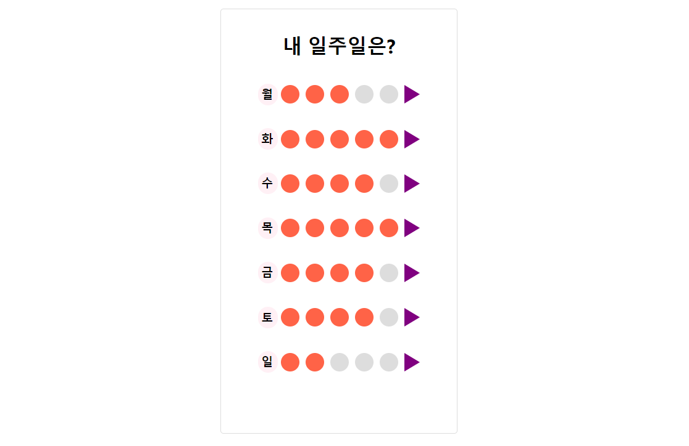
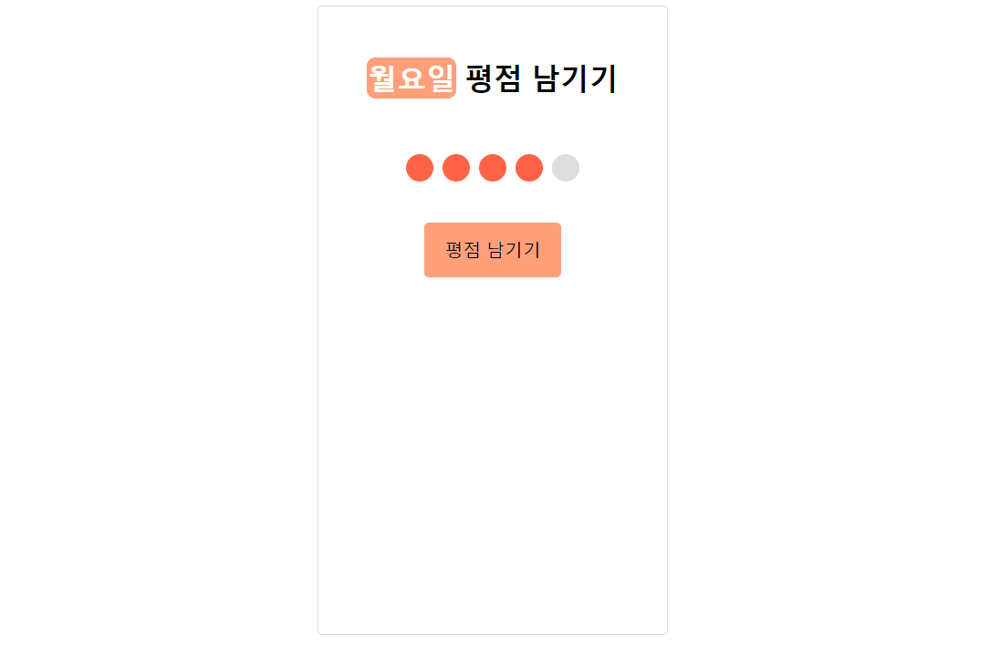

# 리액트 입문 주차 본격적인 시작

이번 주차에서 리액트를 처음 다뤘는데 기존에 공부했던 자바스크립트 언어를 기반으로 새로운 라이브러리를 사용해봤다. 처음이라 익숙하지 않았지만 리액트에 대해 알고 원하는 기능을 구현하면서 점점 리액트에 재미를 붙이고 있는 것 같다는 생각이 들었다.

## 항해 99 3주차 리액트 개인 과제

**프로젝트 기간:** 2022.03.17~2022.03.21 (총 5일간)

**개인과제명:** 내 일주일 평점 남기기

### 필수 포함 사항

#### 메인페이지 기능
- 일주일 평점 보여주기: 평점은 1~5까지 숫자 중 랜덤한 정수 만들기
- 각 요일 옆 삼각형 버튼을 누르면 요일 평점 남기기 페이지로 이동

#### 평점 남기기 페이지 기능
- 선택한 요일 보여주기
- 동그라미 눌러서 평점 입력하기
- 남기기 버튼을 누르면 이전 페이지로 이동하기

### 구현한 페이지 및 기능

#### 1. 메인페이지

- **일주일 평점 보여주기**
  - 1~5까지의 랜덤 정수 만들어 동그라미 색칠하기
  - 삼각형 버튼을 클릭하면 각 요일 평점 입력 페이지로 이동하기

#### 2. 평점 남기기 페이지

- **평점 남기기**
  - 페이지 이동시 선택한 요일 보여주기
  - 동그라미 눌러서 평점 입력하기 (단, 여기서 평점을 입력한다는 것은 동그라미 입력을 의미하는 것으로 실제 숫자가 반영되는 것은 아님)
  - 남기기 버튼을 누르면 이전 페이지로 이동하기

#### 3. 깃허브 레파지토리
 
[GitHub - JIEUN24/React_1: React 입문 첫주차 개인과제(03.17.~03.21.) - 평점 입력하기](https://github.com/JIEUN24/React_1)

## 주요 개념 정리 (이번주차 키워드)

### DOM이란?
DOM은 Document Object Model의 약자로 문서 객체 모델이라고 할 수 있는데 여기서 문서 객체는 html 문서의 태그들을 자바스크립트가 이용할 수 있는 객체로 만들어 놓은 것을 말한다. 여기에 모델을 더하여 DOM을 다시한번 정의해본다면 HTML문서에 접근하기 위한 일종의 인터페이스라고 정의할 수 있을 것이다. 이 객체 모델은 문서 내에 있는 모든 요소를 정의하고, 각각의 요소에 접근하는 방법을 제공할 수 있다.

### Document 객체
Document 객체는 웹 페이지 그 자체를 의미하는데 HTML 내에 있는 요소에 접근하려면 반드시 Document 객체로부터 시작해야한다. 또한 Document 객체는 HTML 요소와 관련된 작업을 도와주는 다양한 메소드를 제공하기 때문에 HTML 요소를 선택하는 메소드를 잘 알아둘 필요가 있다.

### 서버리스란?
서버리스란 클라우드 컴퓨팅 모델 중 하나로 개발자가 서버를 따로 관리할 필요 없이 애플리케이션을 빌드하고 실행할 수 있도록 하는 클라우드 네이티브 개발 모델이다.

서버리스를 사용하게 되면 서버를 따로 관리할 필요가 없어 개발자의 생산성을 높이고 운영비용 또한 줄일 수 있게 되는데 서버단위로 요금을 지불하는 것이 아니라 실제 사용 자원에 대해서만 요금이 청구되기 때문에 비용 면에서도 경제적이라 할 수 있다.

## 소감

3주차를 시작하며 리액트를 처음 접하게 되었는데 자바스크립트를 기반 새로운 라이브러리를 사용하게 되었다. 주특기를 리액트로 선택한만큼 주어진 과제 수행과 개인 공부시간을 늘려 리액트에 집중해야겠다는 생각이 들었다. 

과제를 하는데 있어 어려움도 있었지만 구글링을 통해 해결한 부분도 있었고 멘토님과 함께 해결한 부분도 있었다. 어려웠던 부분을 하나씩 해결해나가면서 리액트에 재미를 붙이게 된 것 같은데 앞으로 리액트에 익숙해지기 위해 최선을 다할 것이다.

3주차 공부시간 기록: 121시간 25분

---
